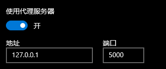

# Socket Programming: SMTP client

### To run the proxy server

```
python3 proxy_server.py --host <your-host> --port <your-port>
```


### To get help doc

```
python3 proxy_server.py --help
```


### To test in browser

You can first configure your system proxy in Setting



And run (by default, it use 127.0.0.1 a.k.a localhost and 5000 port)

```
python3 proxy_server.py
```

And browse some URLs (which should not be `https`). 

E.g. browse

- http://chihaozhang.com/

- http://www.baidu.com
- http://ticket.siriusneo.top/
- http://jekyllcn.com/


### To test using Python requests

Please modify the code in `test_client.py` and run it with the proxy server running. Make sure the `requests` lib is installed.

```
python3 test_client.py
```


### To test using requests and a local Flask server

First run the Flask server

```
python3 test_server.py
```

By default it runs on port 9000. Then modify the code `proxy_server.py` line 159 

```
sock.connect((host, 9000))
```

And send some request using `test_client.py`. You can see the request shown up in Flask command line.