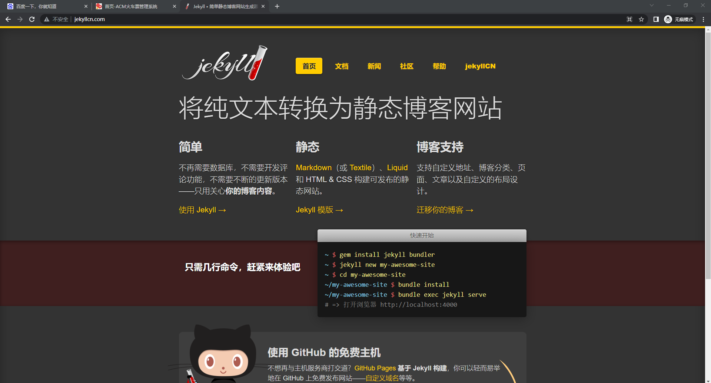

# Report of Socket Programming: Proxy Server

> Computer Networking (CS391) Socket Programming Assignment, A simple proxy server implemented in Python.

作者：林超凡，520021911042


## 1. 项目结构

```
SMTP
- proxy_server.py        # 实现
- 404.html               # 404 报错页面
- Report.md              # 本报告
- .proxy_cache/          # 由 proxy_server 创建的 cache 文件夹
- test_client.py         # 使用 requests 发送请求的本地模拟 client
- test_server.py         # 使用 Flask 创建的简单的模拟 server
- test_pic/              # 测试截图
```

`class ProxyServer` 实现了一个简单的代理服务器，使用简单的命令行工具 `getopt` 包装，便得到一个简洁的单文件代理服务器。


## 2. 使用与功能

## 2.1 使用

使用命令行来启动代理服务器：

```
python3 proxy_server.py --host <your-host> --port <your-port>
```

获取帮助

```
python3 proxy_server.py --help
```


## 2.2 支持功能

- 基本的代理功能

- GET/POST 请求支持

- 基本的报错处理（404）

- 对 GET 请求进行 cache


## 3. 测试

- [x] **基本的代理功能**

  由于没有使用 SSL，只能代理 `http` 协议的网页。本项目使用张弛豪老师的主页：http://chihaozhang.com/ 进行测试（因为他没挂证书）

  在系统开启代理服务器：

  

  启动 Proxy Server（默认 host 即为 `localhost`，port 为 `5000`）

  
  
  在 Google 浏览器中得到页面（可能要等一会儿）
  
  
  
  可以同时观察命令行输出
  
  
  
  可以看到 proxy 收到了 client 的请求，并将其发送给了 server，然后得到的 response 被创建为 cache 文件。cache 部分在下面的测试会细讲。
  
- [x] **POST 请求支持**

  为了方便测试 POST 请求，我们在本地开一个简单的 Flask 服务器（代码见 `test_server.py`）。它收到 POST 请求后会将请求的 data 打印出来。

  同时我们用模拟的 client 来发送请求（代码见 `test_client.py`）

  ```python
  proxies = {'http': 'http://localhost:5000'}
  payload = {"cmd_input": "test"}
  url = 'http://localhost'
  resp = requests.post(url, proxies=proxies, json=payload, verify=True)
  ```

  注意此时要将实现 `proxy_server.py` 的 159 行中的

  ```python
  sock.connect((host, 80))
  ```

  端口号替换成 Flask 服务器所在的端口号。

  

  可以看到服务端确实接收到了 POST 请求以及其传来的参数（字典）。

- [x] **基本的报错处理**

  由于此项目比较简单，我只写了一个 404 页面，并且为了测试方便，只要 Status Code 不为 200，proxy server 便会返回此错误页面。

  这里我使用一个自己的暂时弃用的网址 http://me.tric.space 进行测试

  

  可以看到在浏览器中能发现错误页面。

- [x] **对 Get 请求进行 cache**

  在测试基本的代理功能时，我们对 http://chihaozhang.com/ 进行访问，并且看到命令行里显示了 cache 文件被创建。

  在 `.proxy_cache/` 下，我们确实看到了一些 cache 文件

  
  
  然后我们在浏览器重复访问（注意要用 `ctrl+f5` 强制刷新，不然浏览器也有 cache ），可以看到命令行提示 cache hit
  
  
  
  并且我们也能很快在浏览器中看到之前的页面
  
  

- [x] 综合测试

  我们将代理服务器挂上系统代理，并访问几个网站。由于没有实现 SSL 加密，均使用 80 端口（http），因此我只测试了一些非 https 网站

  - http://www.baidu.com 百度主页

    

  - http://ticket.siriusneo.top/ （这个是我大一的火车票管理系统作业，主页含大量静态资源）

    

  - http://jekyllcn.com/ Jekyll 主页

    

并且可以在 `.proxy_cache/` 下面看到缓存文件


## 4. 实现细节

### 4.1 基本架构

```
Client --- Proxy Server --- Server
```

其中 Proxy Server 同时扮演 client 和 server 的角色。

Proxy 本身自己有一个服务端 socket `self._server_socket`，其 bind 到我们事先指定的 host 与 port 上，然后使用一个 forever 循环进行持续监听。

client 在指定代理后，它的网络请求将会被服务端 socket accept 到，得到 `client_socket`，我们对 client 传来的报文进行一定程度的解析，获得一些关键字段的信息。

然后我们以请求的 url 为 key 值，在 cache 文件夹中查询是否存在 cache，此部分由 4.4 详细介绍。若 cache miss，则此时 Proxy Server 成为客户端，需要向 Server forward 那个 client 的请求。此处对于 GET 请求，我们手动根据 client 的报文重新构造；对于 POST 请求，我们直接将 client 的报文进行转发。

发送这个请求还需要新建一个 socket（为了方便，我把整个请求封装成了一个私有方法 `_http_request`），并且 connect 到 Server 的 host 的 80 端口（http），然后发送请求报文，接受 response。

对 response，我们也要做一定程度的报文解析，对 Status_Code 进行判断。如果不为 200，我们的代理服务器会返回一个错误页面给 client；否则将 response 转发回 client。

### 4.2 HTTP 协议

HTTP 协议的报文格式大致如下：

- http request

```
<Method> <Url> <http version> # 如 GET http://www.baidu.com HTTP/1.0
Headers1 <CRLF>
Headers2 <CRLF>
...
<CRLF>
Content
```

- http response

```
<http version> <Status_Code> <Status_Name> # 如 HTTP/1.0 200 OK
Headers1 <CRLF>
Headers2 <CRLF>
...
<CRLF>
Content
```

在使用 socket 实现 http 的过程中，有一个问题：如果报文长度大于`socket.recv` 的缓冲区长度，需要再次接受，而不断接受又会导致 `recv` 卡死，所以需要预先知道接受的数据长度。解决方法是，先接受一段数据，然后在报文中手动解析出 `Content-Length` 字段的值，再找到 headers 与 content 分割处从而推断出 header 的长度，最后便可以获得总长度：header_length + 4 + content_length（注意两个 `<CRLF>` 占 4 个位置），这样才能确保接受完整内容。

### 4.3 实现错误处理

在 4.1 中我们提到了我们会对 response 做解析，若发送错误，我们会返回一个错误页面给 client，错误页面见同目录下的 `404.html`。我们直接将其包装成一个简单的 http response 然后发回 client。

### 4.4 实现 Cache

cache 文件储存于 `.proxy_cache/` 下，文件名为请求的 url（为了避免一些冲突，会对非法字符进行替换），以 `.cachefile` 后缀为结尾，所储存的内容为此请求对应的 response 数据（即 socket 读到的 bytes）。

在接收到 client 的新请求后，若 url 对应的 cache 文件存在，则 Proxy Server 会向此服务端发送一个 http GET request，这个 request 中含有 `If-Modified-Since` 这一字段，表示查询页面是否发生变化。

若返回值为 200，说明发生变化，response 中同时含有新页面的信息，proxy server 会更新 cache 同时将 response 发回 client；

若返回值为 304 Not Modified，说明页面不发生变化，这时候 proxy server 会提示 cache hit，同时将对应的 cachefile 发回 client。