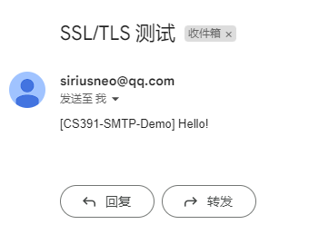
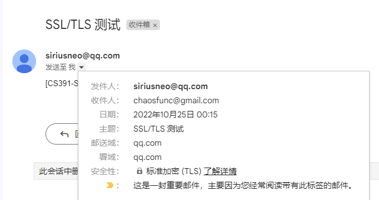
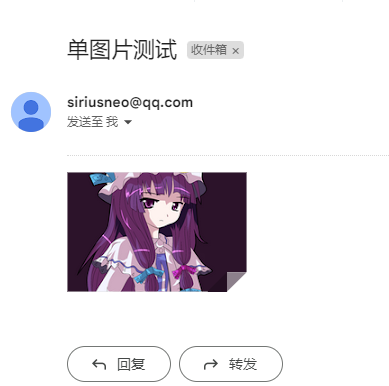

# Report of Socket Programming: SMTP client

> Computer Networking (CS391) Socket Programming Assignment, A simple SMTP client implemented in Python.

作者：林超凡，520021911042

## 1. 项目结构

```
SMTP
- smtp_client.py        # 实现
- test_smtp_client.py   # 测试
- Report.md             # 本报告
- pic1.png              # 用于测试的png格式图片
- test_xxx.png          # 测试成功的screentshot
```

作业要求了 SMTP 客户端的实现被封装为类 `class SMTPClient`。除了正常初始化使用外，本项目也将其封装成了上下文管理器方便使用。

此外，为了方便支持不同类型数据的发送， 本项目还包含一个对 **MIME**(Multipurpose Internet Mail Extensions) 的简单实现 `class MIMEModel` 。

## 2. 简单的示例

更多示例详见 `test_smtp_client.py` 

快速创建一个使用 SSL 的 client 并发送纯文本：

```python
with SMTPClient(host="smtp.qq.com", port=465, mode="ssl") as client:
    client.login("<your smtp username>", "<your smtp pass>")
    client.send_by_myself(
        receivers=["<a recevier>"],
        data="测试"
    )
```

这里的 data 字符串被自动转换成 MIME 进行发送，以免被接收方放入**垃圾箱**。

你也可以手动使用 `MIMEModel` 来构造一个规范的 MIME，或者使用 python `email` 库中的 MIME 进行发送。

## 3. 测试情况

测试详见  `test_smtp_client.py` 

测试均使用我的 QQ 邮箱发送，Google 邮箱接受。

- [x] 纯文本发送

  

- [x] 开启 SSL/TLS 并使用 465 端口进行发送

  

  加密信息

  

- [x] 单图片发送

  

  值得一提的是，不加 `attachment; filename=` 这些字段的话，在交大邮箱下看起来效果和图片附件是不一样的

  

- [x] 文字 + 附件发送

  

- [x] 图片内嵌于文字发送，使用 html

  

## 4. Use of Protocols

实现此项目共用到了如下 SMTP 标准指令

```
HELO
LOGIN
MAIL
RCPT
DATA
QUIT
```

其中 `HELO` 被用在连接时建立会话，`AUTH LOGIN` 用于登录，中间部分的 `MAIL` `RCPT` `DATA` 用于实现发送邮件，最后 `QUIT` 用来退出。

## 5. API Doc

- `class SMTPClient`  简单的 SMTP client 实现

  - ```python
    def __init__(self, host: str = "", port: Union[str, int] = 25, mode = "plain"):
        """
        	初始化 SMTP 客户端. 如果给定了 host 与 port, 将会自动 connect.
        	
        	Parameters
        	----------
        	host: str
        		SMTP 服务器名, 如 smtp.qq.com
            port: Union[str, int]
            	SMTP 端口号, 默认是 25, SSL 下需要走 465
            mode: str
            	plain/ssl, 表示明文/SSL加密
        """
    ```

  - ```python
    def connect(self, host: str, port: Union[str, int] = 25):
        """
        	创建 socket 并发送 HELO.
        	
        	Parameters
        	----------
        	host: str
        		SMTP 服务器名.
            port: Union[str, int]
            	SMTP 端口号.
        """
    ```

  - ```python
    def login(self, username: str, auth_pass: str):
        """
        	登录, 使用 AUTH LOGIN
        	
        	Parameters
        	----------
        	username: str
        		SMTP 用户名, 一般是邮箱号.
            auth_pass: str
            	SMTP 的代码, 注意一般不是某个邮箱服务的账号密码.
        """
    ```

  - ```python
    def quit():
        """
        	退出. 使用 QUIT.
        """
    ```

  - ```python
    def send(self, sender: str, receivers: Union[str, List[str]], data):
        """
        	发送邮件. 流程是 MAIL -> RCPT -> DATA -> <CRLF>.<CRLF> (to end it)
        	
        	Parameters
        	----------
        	sender: str
        		发送者, 会被标注在 From 上
            receivers: Union[str, List[str]]
            	接收者, 可以有很多个, 会被标注在 To 上用 , 分隔.
            data: List[Union[str, MIMEModel, ...]]
            	发送数据, 类型可以是 str (自动传成plain_text), MIMEModel 或者 python email包里的 MIME
        """
    ```

  - ```python
    def send_by_myself(self, receivers: Union[str, List[str]], data):
    	"""
    		将sender设为登录时所用的username, 然后send.
        """
    ```

- `class MIMEModel`  简单的 MIME 实现

  - ```python
    def __init__(self):
    	"""
    		初始化一个MIME.
    	"""
    ```

  - ```python
    def __str__(self):
    	"""
    		MIME to str
    	"""
    ```

  - ```python
    def add_header(self, header_name: str, header_value: str):
        """
        	给此MIME添加一个Header.
        """
    ```

  - ```python
    def has_header(self, header_name: str) -> bool:
        """
            判断此MIME是否包含这个header.
        """
    ```

  - ```python
    def attach(self, submime: "MIMEModel"):
        """
            添加一个子段. 要求自身必须是 multipart 格式.
        """
    ```

  - ```python
    @staticmethod
    def create_base(from_name = "", to_name = "", subject = "") -> "MIMEModel":
    	"""
    		创建并返回一个具有基本几个信息header的MIME.
    	"""
    ```

  - ```python
    @staticmethod
    def create_text(from_name = "", to_name = "", subject = "", subtype="plain", text = []) -> "MIMEModel":
        """
    		创建并返回一个文本类型的MIME.
    	"""
    ```

  - ```python
    @staticmethod
    def create_png(from_name = "", to_name = "", subject = "", pic_path: str = "", file_name: str = "") -> "MIMEModel":
        """
    		创建并返回一个PNG图片类型的MIME.
    	"""
    ```

  - ```python
    @staticmethod
    def create_multipart(from_name = "", to_name = "", subject = "", subtype = "related") -> "MIMEModel":
    	"""
    		创建并返回一个 Multipart MIME.
    	"""
    ```